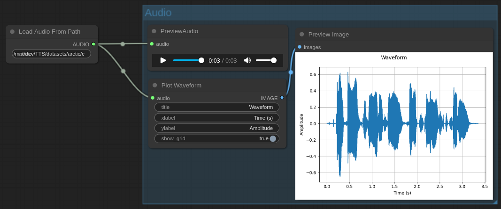
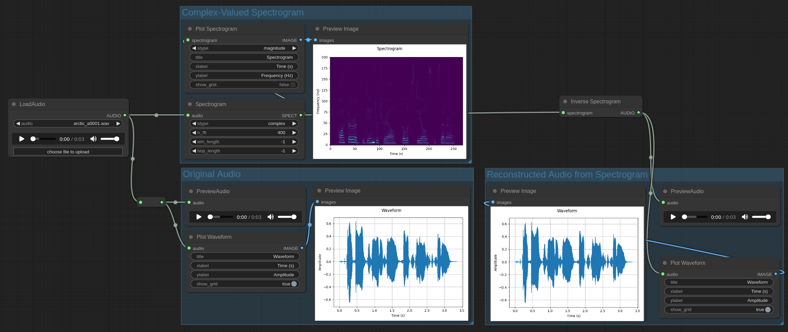
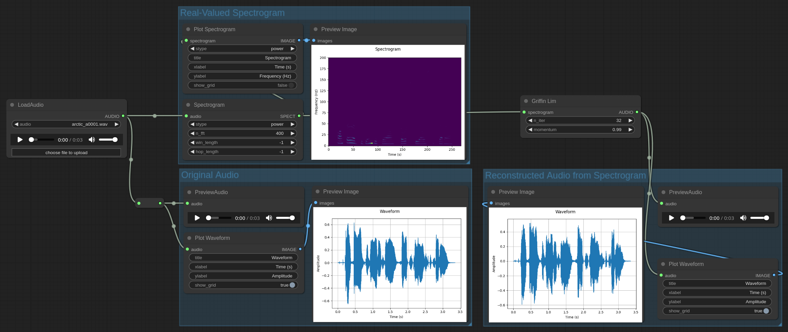

# comfyui-audio-plugin
> A collection of nodes for working with audio data.

- [Audio Waveforms](#audio-waveforms)
- [Spectrograms](#spectrograms)
  - [Complex-Valued Spectrograms](#complex-valued-spectrograms)
  - [Real-Valued Spectrograms](#real-valued-spectrograms)
- [Filter Banks](#filter-banks)
  - [Mel-scale Spectrograms](#mel-scale-spectrograms)
- [License](#license)

> [!NOTE]
>
> This plugin is compatible with the ComfyUI audio nodes.

## Audio Waveforms

| Name                 | Description                                                                         |
|----------------------|-------------------------------------------------------------------------------------|
| Load Audio From Path | Same as "Load Audio" but loads from a local path instead of an uploaded audio file. |
| Plot Waveform        | Plots the waveform of an `AUDIO` object.                                            |

## Spectrograms

| Name                | Description                                                                    |
|---------------------|--------------------------------------------------------------------------------|
| Spectrogram         | Computes the spectrogram of a given `AUDIO` object.                            |
| Inverse Spectrogram | Converts a complex-valued spectrogram to `AUDIO`.                              |
| Griffin Lim         | Converts a real-valued spectrogram to `AUDIO` using the Griffin-Lim algorithm. |
| Plot Spectrogram    | Plots the spectrogram of a `SPECT` object.                                     |

A spectrogram (`SPECT`) can be one of three types:
1. `complex` &ndash; a complex number valued spectrogram;
2. `magnitude` &ndash; a real valued spectrogram that is the absolute value of the `complex` spectrogram (power 1);
3. `power` &ndash; a real valued spectrogram that is the square of the `magnitude` spectrogram (power 2);

### Complex-Valued Spectrograms

### Real-Valued Spectrograms

## Filter Banks

| Name                  | Description                                         |
|-----------------------|-----------------------------------------------------|
| Mel-scale Filter Bank | Create a mel-scale filter bank.                     |
| Apply Filter Bank     | Apply the specified filter bank to the spectrogram. |
| Plot Filter Bank      | Plots the `FILTER_BANK` object.                     |

### Mel-scale Spectrograms

## License
Copyright (C) 2024 Reece H. Dunn

SPDX-License-Identifier: [GPL-3](LICENSE)
